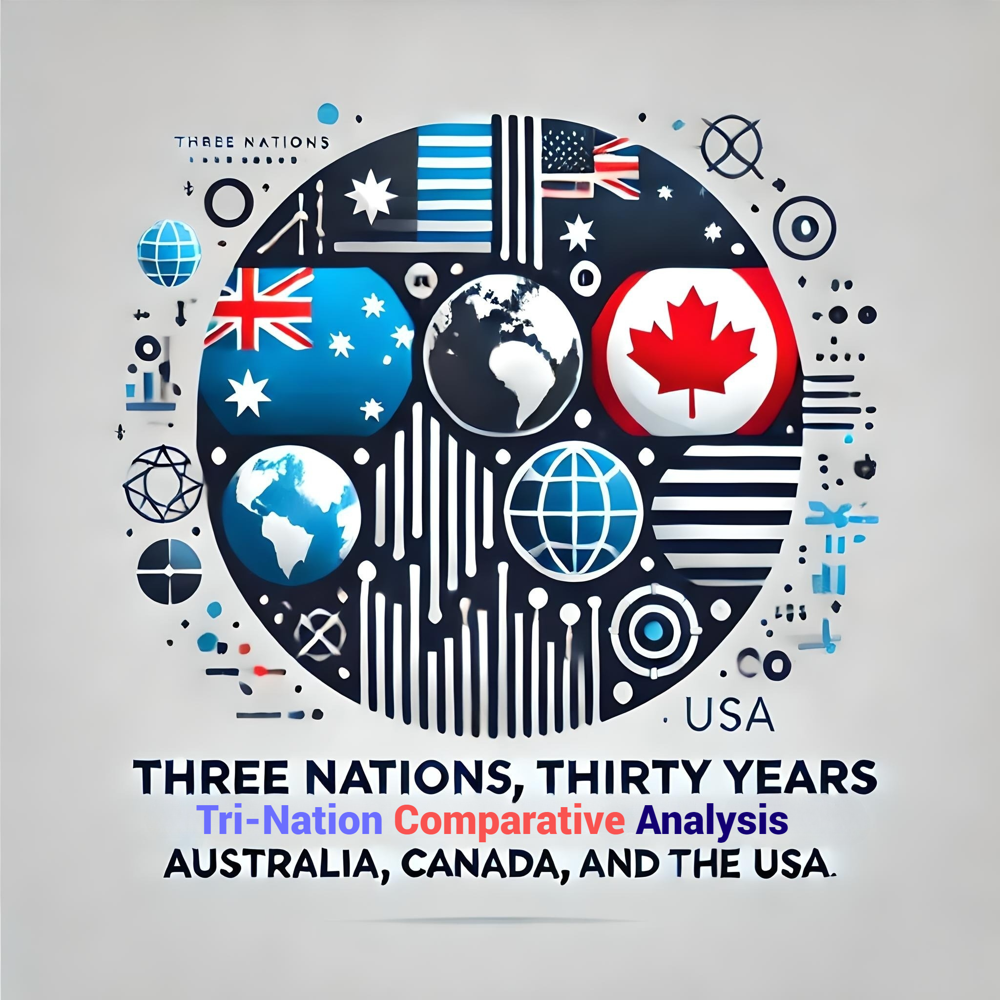
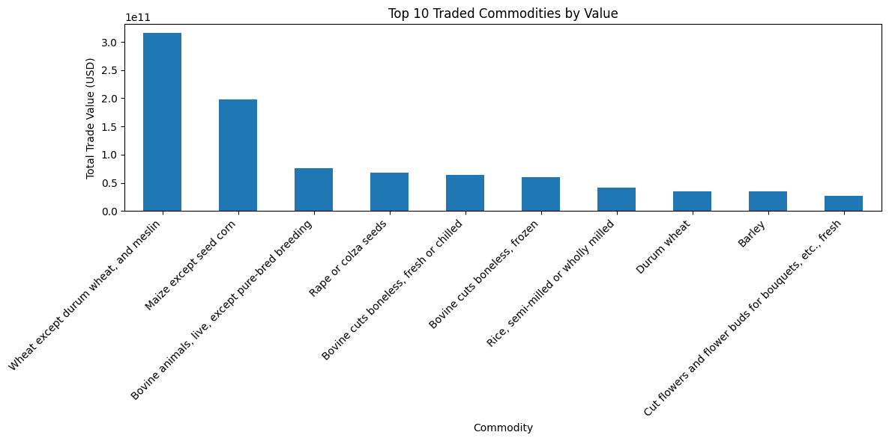
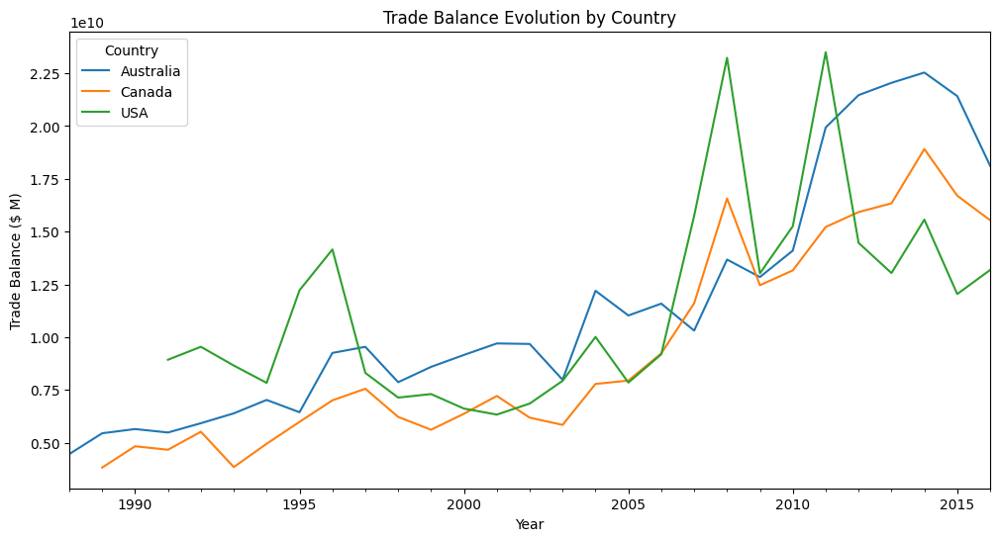
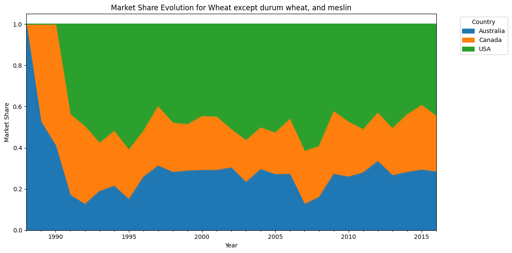

# 🌎Three_Nations_Thirty_Years_Unraveling_Trade_Insights_from_Australia_Canada_and_the_USA




## 📊 Project Overview

This project dives deep into the trade dynamics of Australia, Canada, and the USA over three decades. Using comprehensive data analysis and visualization techniques, we uncover fascinating insights about commodity trades, market trends, and economic patterns.

### 🌟 Key Features

- **30-Year Time Span**: Analyze trade data from 1988 to 2016
- **Multi-Country Analysis**: Compare and contrast trade patterns across Australia, Canada, and the USA
- **Commodity Focus**: Explore trends in various commodity categories, with a special emphasis on agricultural products

## 🚀 Quick Start

```bash
git clone https://github.com/yourusername/trade-analysis-project.git
cd trade-analysis-project
pip install -r requirements.txt
jupyter notebook Trade_Analysis.ipynb
```

## 📈 Key Insights

1. **Agricultural Dominance**: 🌾 Wheat and maize lead as top traded commodities
2. **USA Market Power**: USA Consistently shows higher trade volumes and market share
3. **Seasonal Patterns**: 🌞🍂 Clear seasonal trends in commodity trades, especially in wheat
4. **Increasing Variability**: 📊 Growing range in trade values over time
5. **Price Volatility**: 💹 Significant variations in commodity price stability

## 🛠️ Technologies Used

- 
- 
- 
- 
- 

## 📁 Project Structure

```
trade-analysis-project/
│
├── 📓 Tri_Tri_Trade_Dynamo.ipynb # Main Jupyter notebook
├── 📊 Tri country trade data.csv # Dataset 
├── 📘 README.md                  # Project documentation
```

## 🔍 Analysis Highlights

1. **Top Traded Commodities**
   

2. **Trade Balance Evolution**
   

3. **Market Share Dynamics for wheat**
   

## 🤝 Contributing

Contributions, issues, and feature requests are welcome! 

## 📜 License

This project is [MIT](https://choosealicense.com/licenses/mit/) licensed.

## 👏 Acknowledgements

- Data source: [[Check this repo for data source](https://github.com/vishalv91/Global-Trade-Analytics)]
- Inspiration: Global trade dynamics and economic interplay between nations

---

<p align="center">
  Made with ❤️ by Kvs
</p>